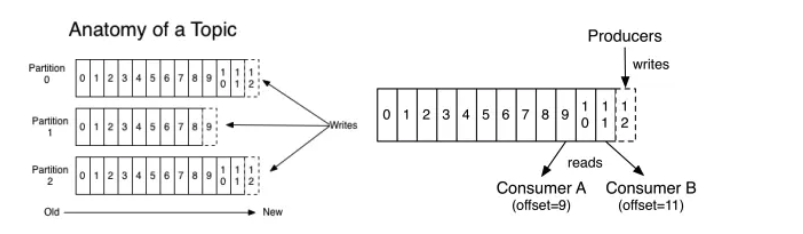
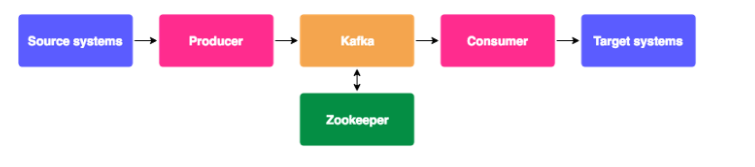
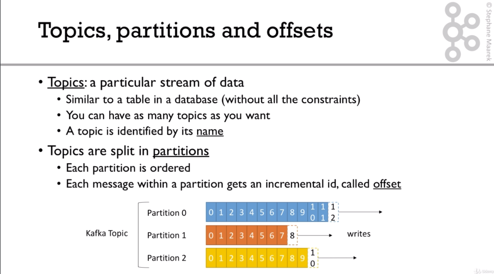
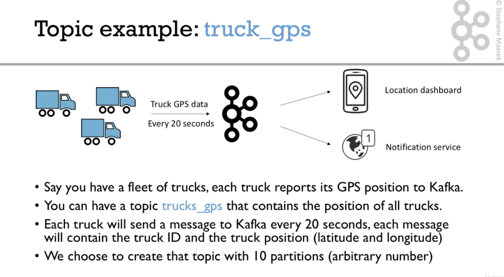
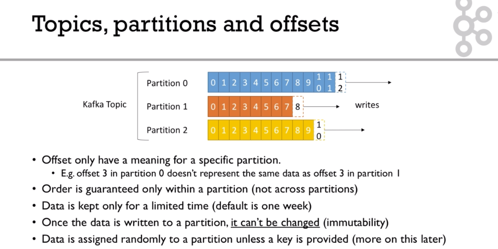

# Kafka

[kafka-beginners-course](https://github.com/simplesteph/kafka-beginners-course)

> ## Why apache kafka

- Created by `Linkedln`, now open source project mainly maintained by confluent
- Distributed, resilient architecture, fault tolerant
- Horizontal scalability
  - Can scale to 100s of brokers
  - Can scale to millions of message per second
- High performance(latency of less than 10ms) - real time
- Used by the 2000+ firms, 35% of the fortune 500:

  - Aribnb
  - LinkedIn
  - Uber
  - Netflix
  - Walmart

> ## Use cases

- Messaging system
- Activity tracking
- Gather metrics from many different locations
- Application logs gathering
- Stream processing (with the Kafaka streams Api or Spark for example)
- De-coupling of system dependencies
- Integration with Spark,Flink,Storm,Hadoop, and many other Big Data technologies

> ## Example

- `Netflix` uses Kafka to apply recommendations in real-time while you're watching TV shows
- `Uber` uses Kafka to gather user,taxi and trip data in real-time to compute and forecast demand, and compute surge pricing in real-time
- `LinkedIn` uses Kafda to prevent spam, collect user interactions to make better connection recommendations in real time.

> Remember that Kafka is only used as a transportation mechanism!

> ## Keyword

- `Round-Robin Scheduling` สลับให้แต่ละ process ได้ทำงานคนละหนึ่งช่วงเวลา
  วิธีนี้ถูกออกแบบมาเพื่อใช้กับระบบที่ต้องรองรับรับผู้ใช้จำนวนมากเช่นระบบ time sharing โดยแต่ละ process จะสลับกันเข้าทำงานบน CPU ในระยะเวลาสั้น ๆ เท่า ๆ กันจนกว่างานของแต่ละ process จะเสร็จสมบูรณ์
- `Kafka Core API`
  - `Producer API` ใช้สำหรับส่งข้อมูลเข้าถังของ kafka แต่ละ topics
  - `Consumer API` ใช้สำหรับให้ user เข้ามาดึงข้อมูลแต่ละ topics โดยจะส่งข้อมูลกลับไปทีละ records
  - `Streams API` สำหรับให้ application ทำการดึงข้อมูล (consuming) จาก topics และ ส่งข้อมูลกลับมา (producing)
  - `Connector API` ใช้จัดการเชื่อต่อของ producers และ consumers ที่ต่อระหว่าง Kafka topics และ application ภายนอก
- `Producers` ทำหน้าที่ส่งข้อมูลให้กับ topics ที่กำหนดไว้ และก็ต้องคอยแจกเลือก partition ภายใน topic เองด้
- `Consumers` จะแทนตัวเองด้วย consumer group name โดยแต่ละ record ที่อยู่ใน topic จะถูกส่งให้เพียง 1 consumer ภายใต้ consumer group เท่านั้น เพราะฉะนั้นเราสามารถแบ่ง process ของ consumer ออกเป็นหลายเครื่องเพื่อช่วยในการทำงานได้ แต่ถ้า consumer groups ต่างกันทั้งหมด record ทั้งหมดจะถูก broadcast ให้กับ consumer ทั้งหมดเช่นกัน
- `Topics` คือ หมวดหมู่ หรือ ชื่อ group ของฐานข้อมูลที่จะเผยแพร่ โดยสามารถมีปลายทางได้หลายคน นั้นหมายถึงอาจจะมี cosumer ตั้งแต่ 0 หรือ หลายคนก็ได้

- `Zookeeper` คือผู้จัดการ ที่ทำหน้าที่บริหารจัดการว่าควรจะไปอ่านข้อมูลที่ replica ตัวไหนหรือ Consumer นี้ควรไปอ่านข้อมูลตรงไหนต่อ

> Ecosystem of apache kafka

1. Kafka
2. Source systems
3. Producer
4. Target systems
5. Consumer
6. Zookeeper

> ## section:4 Kafka theory

8. Topics, Partitions and Offsets

