# Kafka

[kafka-beginners-course](https://github.com/simplesteph/kafka-beginners-course)

## Medium

- [Apache Kafka ฉบับผู้เริ่มต้น #1: Hello Apache Kafka](https://medium.com/linedevth/apache-kafka-%E0%B8%89%E0%B8%9A%E0%B8%B1%E0%B8%9A%E0%B8%9C%E0%B8%B9%E0%B9%89%E0%B9%80%E0%B8%A3%E0%B8%B4%E0%B9%88%E0%B8%A1%E0%B8%95%E0%B9%89%E0%B8%99-1-hello-apache-kafka-242788d4f3c6)
- [Apache Kafka ฉบับผู้เริ่มต้น #2: Core concepts](https://medium.com/linedevth/apache-kafka-%E0%B8%89%E0%B8%9A%E0%B8%B1%E0%B8%9A%E0%B8%9C%E0%B8%B9%E0%B9%89%E0%B9%80%E0%B8%A3%E0%B8%B4%E0%B9%88%E0%B8%A1%E0%B8%95%E0%B9%89%E0%B8%99-2-core-concepts-7dfd4358ec04)

- [Apache Kafka ฉบับผู้เริ่มต้น #3: Try Kafka](https://medium.com/linedevth/apache-kafka-%E0%B8%89%E0%B8%9A%E0%B8%B1%E0%B8%9A%E0%B8%9C%E0%B8%B9%E0%B9%89%E0%B9%80%E0%B8%A3%E0%B8%B4%E0%B9%88%E0%B8%A1%E0%B8%95%E0%B9%89%E0%B8%99-3-try-kafka-f6a6a9b93d58)

- [Apache Kafka ฉบับผู้เริ่มต้น #4: Kafka in action](https://medium.com/linedevth/apache-kafka-%E0%B8%89%E0%B8%9A%E0%B8%B1%E0%B8%9A%E0%B8%9C%E0%B8%B9%E0%B9%89%E0%B9%80%E0%B8%A3%E0%B8%B4%E0%B9%88%E0%B8%A1%E0%B8%95%E0%B9%89%E0%B8%99-4-kafka-in-action-15ad18b7c793)

> ## Why apache kafka

- Created by `Linkedln`, now open source project mainly maintained by confluent
- Distributed, resilient architecture, fault tolerant
- Horizontal scalability
  - Can scale to 100s of brokers
  - Can scale to millions of message per second
- High performance(latency of less than 10ms) - real time
- Used by the 2000+ firms, 35% of the fortune 500:

  - Aribnb
  - LinkedIn
  - Uber
  - Netflix
  - Walmart

> ## Use cases

- Messaging system
- Activity tracking
- Gather metrics from many different locations
- Application logs gathering
- Stream processing (with the Kafaka streams Api or Spark for example)
- De-coupling of system dependencies
- Integration with Spark,Flink,Storm,Hadoop, and many other Big Data technologies

> ## Example

- `Netflix` uses Kafka to apply recommendations in real-time while you're watching TV shows
- `Uber` uses Kafka to gather user,taxi and trip data in real-time to compute and forecast demand, and compute surge pricing in real-time
- `LinkedIn` uses Kafda to prevent spam, collect user interactions to make better connection recommendations in real time.

> Remember that Kafka is only used as a transportation mechanism!

> ## Keyword

- `Round-Robin Scheduling` สลับให้แต่ละ process ได้ทำงานคนละหนึ่งช่วงเวลา
  วิธีนี้ถูกออกแบบมาเพื่อใช้กับระบบที่ต้องรองรับรับผู้ใช้จำนวนมากเช่นระบบ time sharing โดยแต่ละ process จะสลับกันเข้าทำงานบน CPU ในระยะเวลาสั้น ๆ เท่า ๆ กันจนกว่างานของแต่ละ process จะเสร็จสมบูรณ์
- `Kafka Core API`
  - `Producer API` ใช้สำหรับส่งข้อมูลเข้าถังของ kafka แต่ละ topics
  - `Consumer API` ใช้สำหรับให้ user เข้ามาดึงข้อมูลแต่ละ topics โดยจะส่งข้อมูลกลับไปทีละ records
  - `Streams API` สำหรับให้ application ทำการดึงข้อมูล (consuming) จาก topics และ ส่งข้อมูลกลับมา (producing)
  - `Connector API` ใช้จัดการเชื่อต่อของ producers และ consumers ที่ต่อระหว่าง Kafka topics และ application ภายนอก
- `Producers` ทำหน้าที่ส่งข้อมูลให้กับ topics ที่กำหนดไว้ และก็ต้องคอยแจกเลือก partition ภายใน topic เองด้
- `Consumers` จะแทนตัวเองด้วย consumer group name โดยแต่ละ record ที่อยู่ใน topic จะถูกส่งให้เพียง 1 consumer ภายใต้ consumer group เท่านั้น เพราะฉะนั้นเราสามารถแบ่ง process ของ consumer ออกเป็นหลายเครื่องเพื่อช่วยในการทำงานได้ แต่ถ้า consumer groups ต่างกันทั้งหมด record ทั้งหมดจะถูก broadcast ให้กับ consumer ทั้งหมดเช่นกัน
- `Topics` เป็นชุดของข้อมูล(หรือ Messages) มีลักษณะเหมือนกับ table ใน database ที่เราคุ้นเคยกัน(แต่ไม่มีตัวเชื่อมโยงในแต่ละ topic นะ) ซึ่งแต่ละ topic เนี่ย จะถูกตั้งชื่อได้ เพื่อให้เรารู้ว่ามันคือข้อมูลเกี่ยวกับอะไร ซึ่งชื่อก็ไม่ควร(จริงๆ ห้าม) ซ้ำกัน ไม่งั้นตอนเอาไปใช้งานก็จะแยกชุดของข้อมูลไม่ได้
  [copy-form-links](https://medium.com/linedevth/apache-kafka-%E0%B8%89%E0%B8%9A%E0%B8%B1%E0%B8%9A%E0%B8%9C%E0%B8%B9%E0%B9%89%E0%B9%80%E0%B8%A3%E0%B8%B4%E0%B9%88%E0%B8%A1%E0%B8%95%E0%B9%89%E0%B8%99-2-core-concepts-7dfd4358ec04)

- `Partitions` ข้อมูลในแต่ละ Topic จะถูกแยกเป็นกลุ่มๆ อีก ซึ่งแต่ละกลุ่มนี้ จะถูกเรียกว่า Partition ข้อมูลในแต่ละ partition จะถูกจัดเรียง(ส่วนเรียกตามอะไร เดี๋ยวจะมาอธิบายต่อครับ) ข้อมูลแต่ละส่วน หรือแต่ละ message เนี่ย จะมีค่าบางอย่างที่มีลักษณะเพิ่มเองได้(incremental) ซึ่งจะเริ่มที่ 0 และเพิ่มค่าเป็น 1 2 3… ไปเรื่อยๆ ตามจำนวนของข้อมูล ซึ่งมันจะถูกเรียกว่า offset หรือตัวนับในแต่ละ partition [copy-form-links](https://medium.com/linedevth/apache-kafka-%E0%B8%89%E0%B8%9A%E0%B8%B1%E0%B8%9A%E0%B8%9C%E0%B8%B9%E0%B9%89%E0%B9%80%E0%B8%A3%E0%B8%B4%E0%B9%88%E0%B8%A1%E0%B8%95%E0%B9%89%E0%B8%99-2-core-concepts-7dfd4358ec04)

- `Topic Replication Factor` ราควรทำความเข้าใจค่านี้ด้วยครับ เป็นค่าที่บอกว่าในแต่ละ topic จะมีการทำสำเนา (replica) partition จากตัวหลัก(leader)ไปสำเนากี่ server หรือ broker (เรียกว่า in-sync replication คือถ้าข้อมูลเข้ามาตัวหลักก็ส่งไปทำสำเนาเพิ่มเลย) ซึ่งควรมีมากกว่า 1 ปกตินิยม 2–3 ครับ และ partition ตัวหลักก็มีได้ 1 ตัว ซึ่งคุณสมบัตินี้เอง เป็นตัวที่ทำให้ Apacha Kafka มีคุณสมบัติ Fault Tolerance (ความทนต่อความเสียหาย) ถ้ามี broker ตัวนึงเน่าไป มันยังสามารถไปอ่านและบันทึกข้อมูลต่อในตัวที่เป็น replica ได้ด้วย โดยการเปลี่ยนตัวสำเนาหรือ replica ให้เป็นตัวหลัก หรือ leader หรือบางคนเรียก master
  [copy-form-links](https://medium.com/linedevth/apache-kafka-%E0%B8%89%E0%B8%9A%E0%B8%B1%E0%B8%9A%E0%B8%9C%E0%B8%B9%E0%B9%89%E0%B9%80%E0%B8%A3%E0%B8%B4%E0%B9%88%E0%B8%A1%E0%B8%95%E0%B9%89%E0%B8%99-2-core-concepts-7dfd4358ec04)
- `Zookeeper` คือผู้จัดการ ที่ทำหน้าที่บริหารจัดการว่าควรจะไปอ่านข้อมูลที่ replica ตัวไหนหรือ Consumer นี้ควรไปอ่านข้อมูลตรงไหนต่อ

> Ecosystem of apache kafka

1. Kafka
2. Source systems
3. Producer
4. Target systems
5. Consumer
6. Zookeeper

> ## section:4 Kafka theory

> 8. Topics, Partitions and Offsets

> 9. Brokers

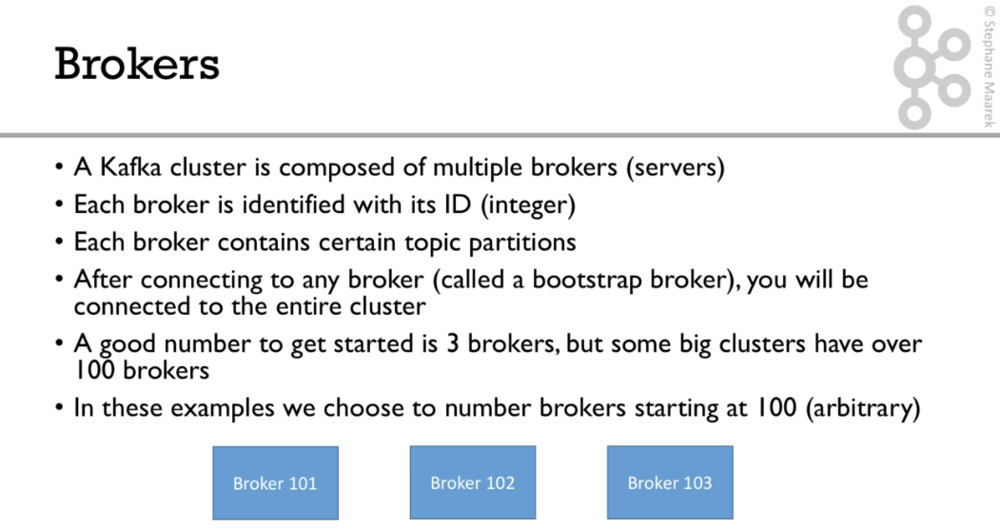

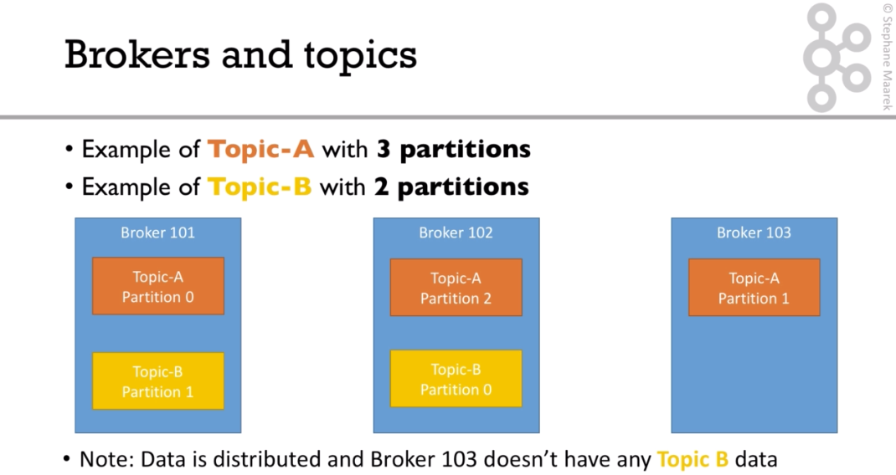

> 10. Topic replication factor

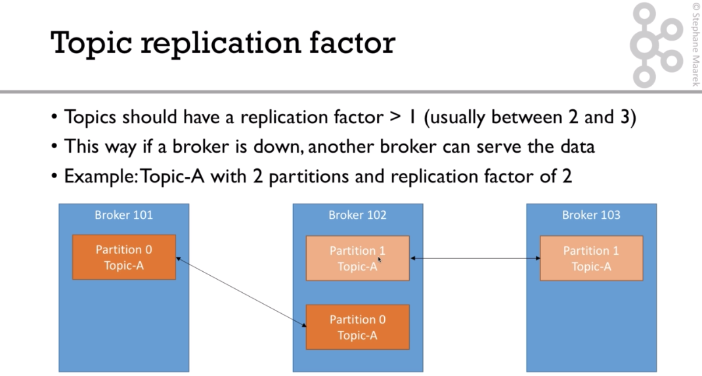

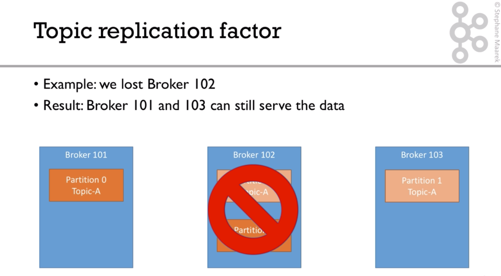

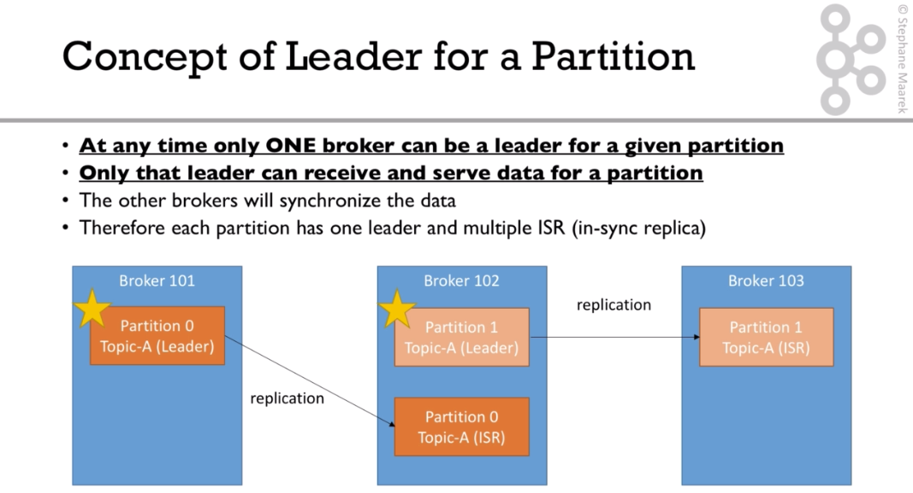

> 11. Producers and Message Keys

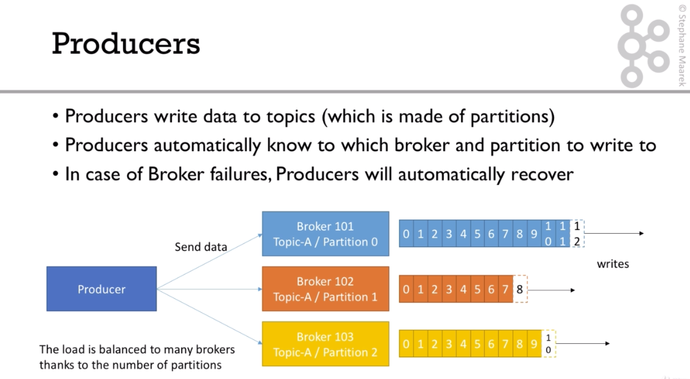

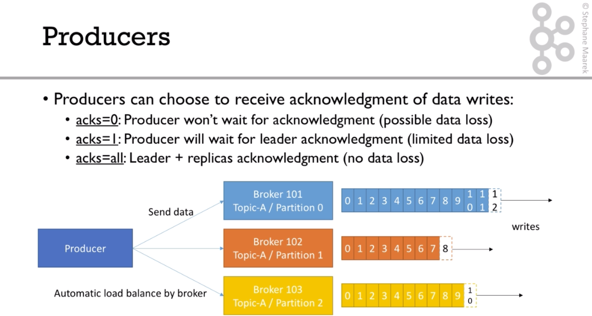

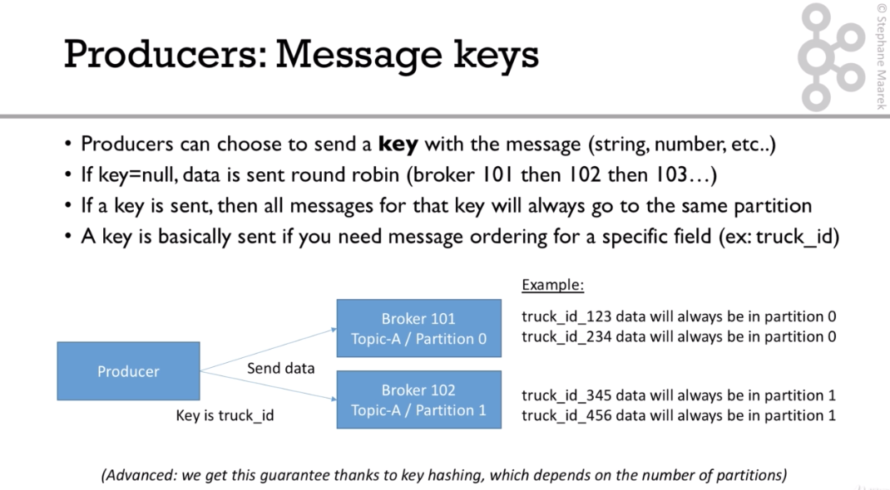

> 12. Consumers

Consumers

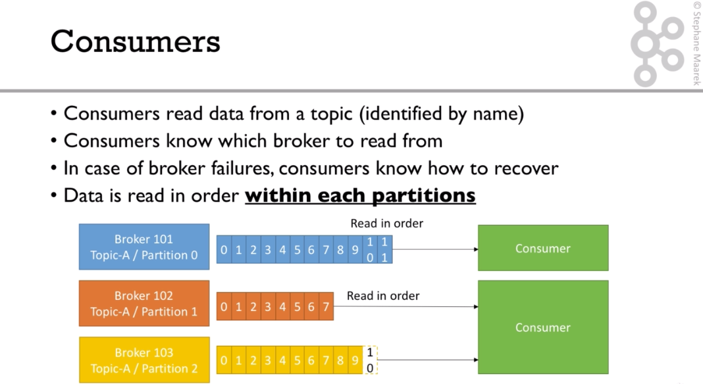

Consumer Groups

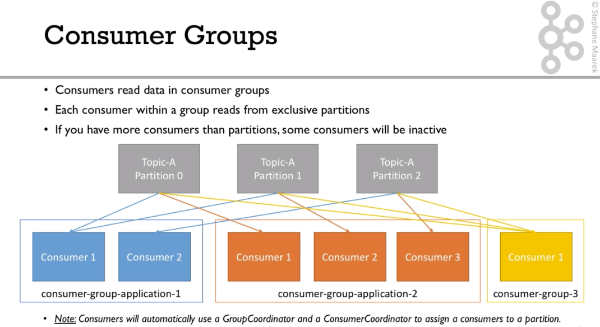

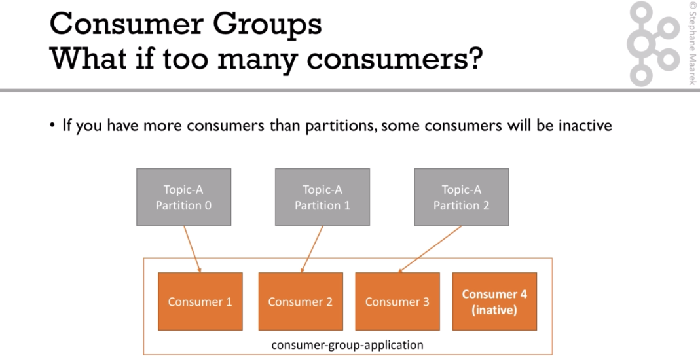

> 13. Consumer Offsets

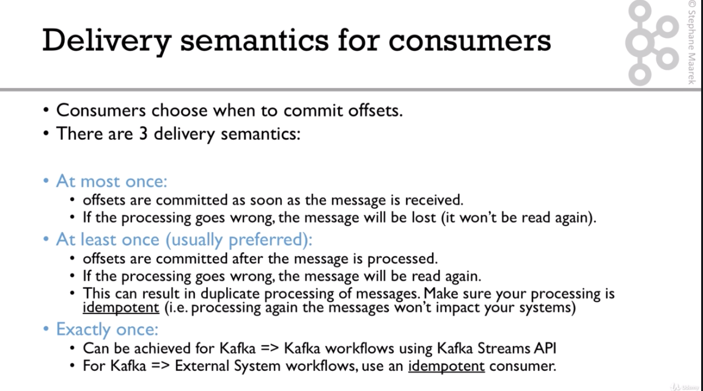

> 14. Kafka Broker Discovery

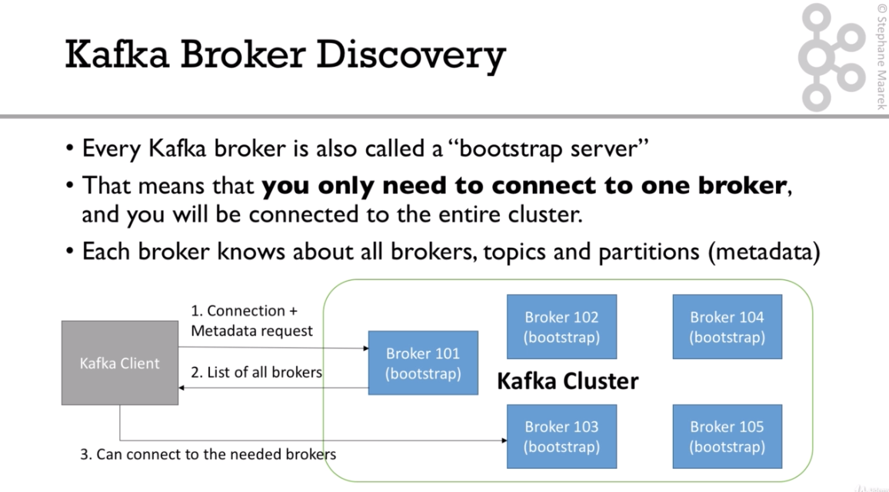

> 15. Zookeeper

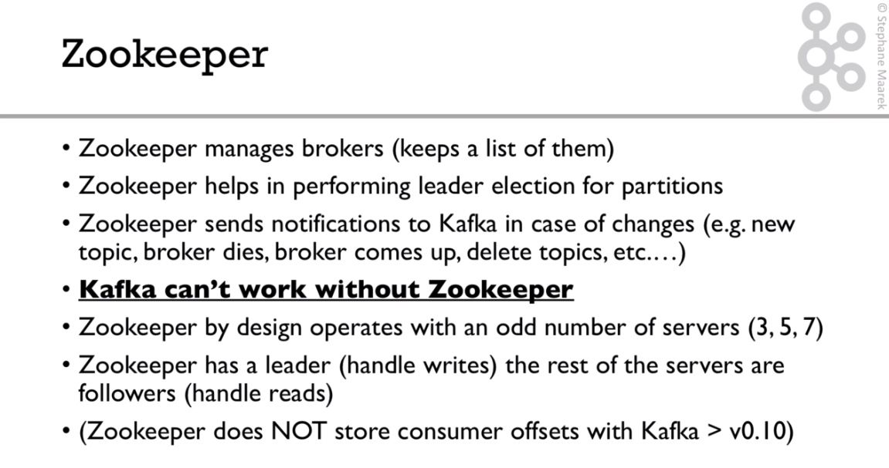

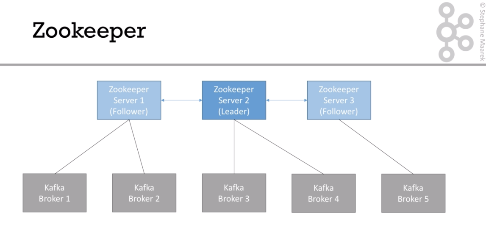

> 16. Kafka Guarantees

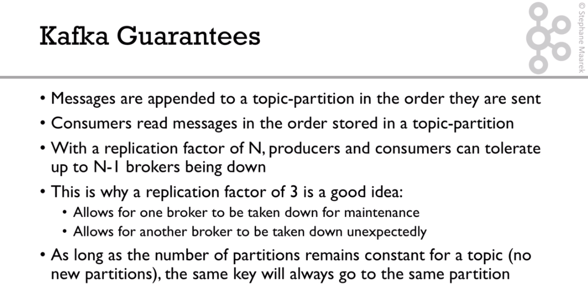

> 17. Theory Roundup

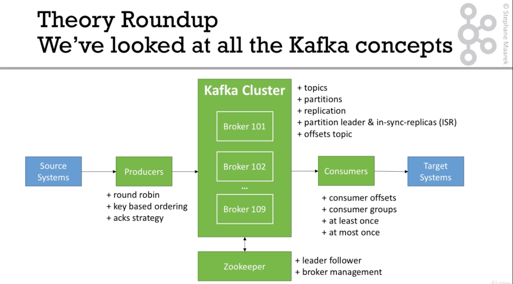
