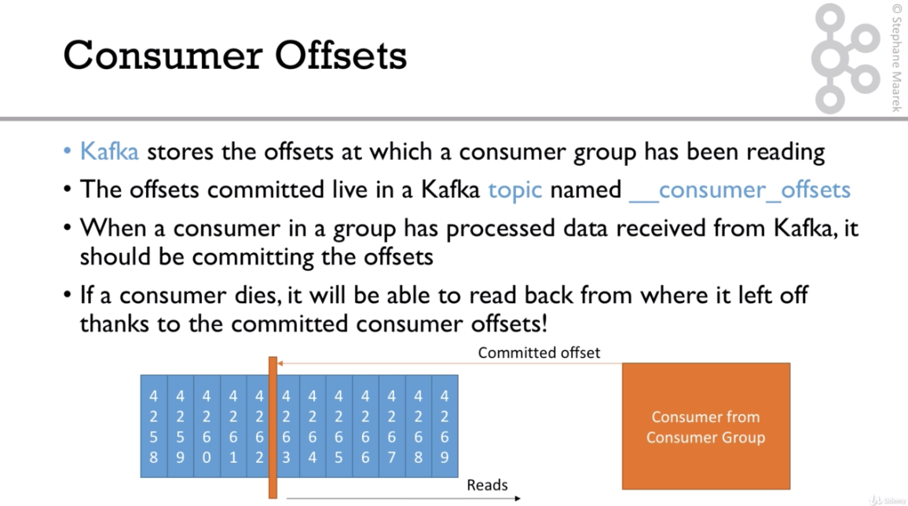

# Kafka

[kafka-beginners-course](https://github.com/simplesteph/kafka-beginners-course)

# Course content

- [x] Section 1 Kafka Introduction
- [x] Section 2 Code Download
- [x] Section 3 Kafka Fundamentals
- [x] Section 4 Kafka Theory
- [x] Section 5 Starting Kafka
- [x] Section 6 CLI
- [ ] Section 7 Kafka Java Programming 101
- [ ] Section 8 Kafka Real World Project
- [ ] Section 9 Kafka Twitter Producer & Advanced Configuration
- [ ] Section 10 Kafka ElasticSearch Consumer & Advanced Configurations
- [ ] Section 11 Kafka Ecosystem & Real World Architectures
- [ ] Section 12 Kafka Extended APIs for Developers
- [ ] Section 13 Real World Insights and Case Studies(Big Data/Fast Data)
- [ ] Section 14 Kafka In the Enterprise for Admins
- [ ] Section 15 Advanced Kafka
- [ ] Section 16 Advanced Topics Configurations
- [ ] Section 17 Annexes
- [ ] Section 18 Annex Starting Kafka Differently
- [ ] Section 19 Next Steps

---

## Medium document about kafka

- [Apache Kafka ฉบับผู้เริ่มต้น #1: Hello Apache Kafka](https://medium.com/linedevth/apache-kafka-%E0%B8%89%E0%B8%9A%E0%B8%B1%E0%B8%9A%E0%B8%9C%E0%B8%B9%E0%B9%89%E0%B9%80%E0%B8%A3%E0%B8%B4%E0%B9%88%E0%B8%A1%E0%B8%95%E0%B9%89%E0%B8%99-1-hello-apache-kafka-242788d4f3c6)
- [Apache Kafka ฉบับผู้เริ่มต้น #2: Core concepts](https://medium.com/linedevth/apache-kafka-%E0%B8%89%E0%B8%9A%E0%B8%B1%E0%B8%9A%E0%B8%9C%E0%B8%B9%E0%B9%89%E0%B9%80%E0%B8%A3%E0%B8%B4%E0%B9%88%E0%B8%A1%E0%B8%95%E0%B9%89%E0%B8%99-2-core-concepts-7dfd4358ec04)

- [Apache Kafka ฉบับผู้เริ่มต้น #3: Try Kafka](https://medium.com/linedevth/apache-kafka-%E0%B8%89%E0%B8%9A%E0%B8%B1%E0%B8%9A%E0%B8%9C%E0%B8%B9%E0%B9%89%E0%B9%80%E0%B8%A3%E0%B8%B4%E0%B9%88%E0%B8%A1%E0%B8%95%E0%B9%89%E0%B8%99-3-try-kafka-f6a6a9b93d58)

- [Apache Kafka ฉบับผู้เริ่มต้น #4: Kafka in action](https://medium.com/linedevth/apache-kafka-%E0%B8%89%E0%B8%9A%E0%B8%B1%E0%B8%9A%E0%B8%9C%E0%B8%B9%E0%B9%89%E0%B9%80%E0%B8%A3%E0%B8%B4%E0%B9%88%E0%B8%A1%E0%B8%95%E0%B9%89%E0%B8%99-4-kafka-in-action-15ad18b7c793)

> ## Why apache kafka

- Created by `Linkedln`, now open source project mainly maintained by confluent
- Distributed, resilient architecture, fault tolerant
- Horizontal scalability
  - Can scale to 100s of brokers
  - Can scale to millions of message per second
- High performance(latency of less than 10ms) - real time
- Used by the 2000+ firms, 35% of the fortune 500:

  - Aribnb
  - LinkedIn
  - Uber
  - Netflix
  - Walmart

> ## Use cases

- Messaging system
- Activity tracking
- Gather metrics from many different locations
- Application logs gathering
- Stream processing (with the Kafaka streams Api or Spark for example)
- De-coupling of system dependencies
- Integration with Spark,Flink,Storm,Hadoop, and many other Big Data technologies

> ## Example

- `Netflix` uses Kafka to apply recommendations in real-time while you're watching TV shows
- `Uber` uses Kafka to gather user,taxi and trip data in real-time to compute and forecast demand, and compute surge pricing in real-time
- `LinkedIn` uses Kafda to prevent spam, collect user interactions to make better connection recommendations in real time.

> Remember that Kafka is only used as a transportation mechanism!

> ## Keyword

- `Round-Robin Scheduling` สลับให้แต่ละ process ได้ทำงานคนละหนึ่งช่วงเวลา
  วิธีนี้ถูกออกแบบมาเพื่อใช้กับระบบที่ต้องรองรับรับผู้ใช้จำนวนมากเช่นระบบ time sharing โดยแต่ละ process จะสลับกันเข้าทำงานบน CPU ในระยะเวลาสั้น ๆ เท่า ๆ กันจนกว่างานของแต่ละ process จะเสร็จสมบูรณ์
- `Kafka Core API`
  - `Producer API` ใช้สำหรับส่งข้อมูลเข้าถังของ kafka แต่ละ topics
  - `Consumer API` ใช้สำหรับให้ user เข้ามาดึงข้อมูลแต่ละ topics โดยจะส่งข้อมูลกลับไปทีละ records
  - `Streams API` สำหรับให้ application ทำการดึงข้อมูล (consuming) จาก topics และ ส่งข้อมูลกลับมา (producing)
  - `Connector API` ใช้จัดการเชื่อต่อของ producers และ consumers ที่ต่อระหว่าง Kafka topics และ application ภายนอก
- `Producers` ทำหน้าที่ส่งข้อมูลให้กับ topics ที่กำหนดไว้ และก็ต้องคอยแจกเลือก partition ภายใน topic เองด้
- `Consumers` จะแทนตัวเองด้วย consumer group name โดยแต่ละ record ที่อยู่ใน topic จะถูกส่งให้เพียง 1 consumer ภายใต้ consumer group เท่านั้น เพราะฉะนั้นเราสามารถแบ่ง process ของ consumer ออกเป็นหลายเครื่องเพื่อช่วยในการทำงานได้ แต่ถ้า consumer groups ต่างกันทั้งหมด record ทั้งหมดจะถูก broadcast ให้กับ consumer ทั้งหมดเช่นกัน
- `Topics` เป็นชุดของข้อมูล(หรือ Messages) มีลักษณะเหมือนกับ table ใน database ที่เราคุ้นเคยกัน(แต่ไม่มีตัวเชื่อมโยงในแต่ละ topic นะ) ซึ่งแต่ละ topic เนี่ย จะถูกตั้งชื่อได้ เพื่อให้เรารู้ว่ามันคือข้อมูลเกี่ยวกับอะไร ซึ่งชื่อก็ไม่ควร(จริงๆ ห้าม) ซ้ำกัน ไม่งั้นตอนเอาไปใช้งานก็จะแยกชุดของข้อมูลไม่ได้
  [copy-form-links](https://medium.com/linedevth/apache-kafka-%E0%B8%89%E0%B8%9A%E0%B8%B1%E0%B8%9A%E0%B8%9C%E0%B8%B9%E0%B9%89%E0%B9%80%E0%B8%A3%E0%B8%B4%E0%B9%88%E0%B8%A1%E0%B8%95%E0%B9%89%E0%B8%99-2-core-concepts-7dfd4358ec04)


- `Partitions` ข้อมูลในแต่ละ Topic จะถูกแยกเป็นกลุ่มๆ อีก ซึ่งแต่ละกลุ่มนี้ จะถูกเรียกว่า Partition ข้อมูลในแต่ละ partition จะถูกจัดเรียง(ส่วนเรียกตามอะไร เดี๋ยวจะมาอธิบายต่อครับ) ข้อมูลแต่ละส่วน หรือแต่ละ message เนี่ย จะมีค่าบางอย่างที่มีลักษณะเพิ่มเองได้(incremental) ซึ่งจะเริ่มที่ 0 และเพิ่มค่าเป็น 1 2 3… ไปเรื่อยๆ ตามจำนวนของข้อมูล ซึ่งมันจะถูกเรียกว่า offset หรือตัวนับในแต่ละ partition [copy-form-links](https://medium.com/linedevth/apache-kafka-%E0%B8%89%E0%B8%9A%E0%B8%B1%E0%B8%9A%E0%B8%9C%E0%B8%B9%E0%B9%89%E0%B9%80%E0%B8%A3%E0%B8%B4%E0%B9%88%E0%B8%A1%E0%B8%95%E0%B9%89%E0%B8%99-2-core-concepts-7dfd4358ec04)

- `Topic Replication Factor` ราควรทำความเข้าใจค่านี้ด้วยครับ เป็นค่าที่บอกว่าในแต่ละ topic จะมีการทำสำเนา (replica) partition จากตัวหลัก(leader)ไปสำเนากี่ server หรือ broker (เรียกว่า in-sync replication คือถ้าข้อมูลเข้ามาตัวหลักก็ส่งไปทำสำเนาเพิ่มเลย) ซึ่งควรมีมากกว่า 1 ปกตินิยม 2–3 ครับ และ partition ตัวหลักก็มีได้ 1 ตัว ซึ่งคุณสมบัตินี้เอง เป็นตัวที่ทำให้ Apacha Kafka มีคุณสมบัติ Fault Tolerance (ความทนต่อความเสียหาย) ถ้ามี broker ตัวนึงเน่าไป มันยังสามารถไปอ่านและบันทึกข้อมูลต่อในตัวที่เป็น replica ได้ด้วย โดยการเปลี่ยนตัวสำเนาหรือ replica ให้เป็นตัวหลัก หรือ leader หรือบางคนเรียก master
  [copy-form-links](https://medium.com/linedevth/apache-kafka-%E0%B8%89%E0%B8%9A%E0%B8%B1%E0%B8%9A%E0%B8%9C%E0%B8%B9%E0%B9%89%E0%B9%80%E0%B8%A3%E0%B8%B4%E0%B9%88%E0%B8%A1%E0%B8%95%E0%B9%89%E0%B8%99-2-core-concepts-7dfd4358ec04)
- `Zookeeper` คือผู้จัดการ ที่ทำหน้าที่บริหารจัดการว่าควรจะไปอ่านข้อมูลที่ replica ตัวไหนหรือ Consumer นี้ควรไปอ่านข้อมูลตรงไหนต่อ

> Ecosystem of apache kafka

1. Kafka
2. Source systems
3. Producer
4. Target systems
5. Consumer
6. Zookeeper


---

## <b>SECTION:4 KAFKA THEORY</b>

---

> 8. Topics, Partitions and Offsets


> 9. Brokers


> 10. Topic replication factor


> 11. Producers and Message Keys


> 12. Consumers

Consumers


Consumer Groups


> 13. Consumer Offsets




> 14. Kafka Broker Discovery


> 15. Zookeeper


> 16. Kafka Guarantees


> 17. Theory Roundup


Starting Kafka

---

## <b>Section 6 CLI(command line interface)</b>

---

Example project by NV4RE [kafka nodeJs example project](https://github.com/devit-tel/example-kafka-node)

> Note kafka zookeeper start at default 127.0.0.1:2181

- start zookeeper server cd to kafka directory and `zookeeper-server-start.sh config/zookeeper.properties`

- start kafka server cd to kafka directory `kafka-server-start.sh config/server.properties`

---

### 32. KAFKA TOPIC CLI

> Note start kafka server and kafka zookeeper first.

- create topics `kafka-topics.sh --zookeeper 127.0.0.1:2181 --topic first_topic --create --partitions 3 --replication-factor 1`

```
WARNING: Due to limitations in metric names, topics with a period ('.') or underscore ('_') could collide. To avoid issues it is best to use either, but not both.
Created topic first_topic.
```

- list topics `kafka-topics.sh --zookeeper 127.0.0.1:2181 --list`

```javascript
first_topic;
```

- describe topics specific topic name `kafka-topics.sh --zookeeper 127.0.0.1:2181 --topic first_topic --describe`

```javascript
Topic:first_topic	PartitionCount:3	ReplicationFactor:1	Configs:
	Topic: first_topic	Partition: 0	Leader: 0	Replicas: 0	Isr: 0
	Topic: first_topic	Partition: 1	Leader: 0	Replicas: 0	Isr: 0
	Topic: first_topic	Partition: 2	Leader: 0	Replicas: 0	Isr: 0
```

- delete topics specific topic name `kafka-topics.sh --zookeeper 127.0.0.1:2181 --topic first_topic --delete`

---

### 33. KAFKA CONSOLE PRODUCER CLI

- produce message `kafka-console-producer.sh --broker-list 127.0.0.1:9092 --topic first_topic`

```javascript
>hello romantic
>hi ro
>hey ro
// control c for exit
```

- produce message with acks=all `kafka-console-producer.sh --broker-list 127.0.0.1:9092 --topic first_topic --producer-property acks=all`

- produce message topic does not exits `kafka-console-producer.sh --broker-list 127.0.0.1:9092 --topic new_topic`

```javascript
> kafka-console-producer.sh --broker-list 127.0.0.1:9092 --topic new_topic
> hey
[2019-09-01 21:07:43,262] WARN [Producer clientId=console-producer] Error while fetching metadata with correlation id 3 : {new_topic=LEADER_NOT_AVAILABLE} (org.apache.kafka.clients.NetworkClient)

// but kafka will auto create topic new_topic

// list all topics again
> kafka-topics.sh --zookeeper 127.0.0.1:2181 --list
// result
first_topic
new_topic

// describe new_topic
> kafka-topics.sh --zookeeper 127.0.0.1:2181 --topic new_topic --describe
// result default setup (num.partitions=1)
Topic:new_topic	PartitionCount:1	ReplicationFactor:1	Configs:
	Topic: new_topic	Partition: 0	Leader: 0	Replicas: 0	Isr: 0

// change default partitions at file config/server.properties
num.partitions=3

// to test auto create topic with 3 partitions stop kafka server and start it's again
> kafka-console-producer.sh --broker-list 127.0.0.1:9092 --topic new_topic_2
>hey
[2019-09-01 21:18:38,768] WARN [Producer clientId=console-producer] Error while fetching metadata with correlation id 3 : {new_topic_2=LEADER_NOT_AVAILABLE} (org.apache.kafka.clients.NetworkClient)
// control c for exit

>kafka-topics.sh --zookeeper 127.0.0.1:2181 --topic new_topic --describe
// result
Topic:new_topic_2	PartitionCount:3	ReplicationFactor:1	Configs:
	Topic: new_topic_2	Partition: 0	Leader: 0	Replicas: 0	Isr: 0
	Topic: new_topic_2	Partition: 1	Leader: 0	Replicas: 0	Isr: 0
	Topic: new_topic_2	Partition: 2	Leader: 0	Replicas: 0	Isr: 0
```

---

### 34. KAFKA CONSOLE CONSUMER CLI

> open 2 tab of terminal

```javascript
// terminal 1 is a producer
// [1]
> kafka-console-producer.sh --broker-list 127.0.0.1:9092 --topic first_topic
// [3]
> hey
```

```javascript
// terminal 1 is a consumer
// [2]
> kafka-console-consumer.sh --bootstrap-server 127.0.0.1:9092 --topic first_topic
// [4] message from [3] will appear.
hey
```

- consumer topic `kafka-console-consumer.sh --bootstrap-server 127.0.0.1:9092 --topic first_topic`
- all message from beginning `kafka-console-consumer.sh --bootstrap-server 127.0.0.1:9092 --topic first_topic --from-beginning`

```
hi ro
just for fun
hey ro
fun learning
hey
hello romantic
some message that is acked
this is a new message
```

---

### 35. KAFKA CONSUMERS IN GROUP

> Consumer group [Rebalanced and shared the load]

Test by open 4 Terminal 1 is producer and 3 are consumer group

```javascript
// Terminal 1 producer
> kafka-console-producer.sh --broker-list 127.0.0.1:9092 --topic first_topic
```

```javascript
// Terminal 2 consumer group name my-first-application
> kafka-console-consumer.sh --bootstrap-server 127.0.0.1:9092 --topic first_topic --group my-first-application
// result
message 2
```

```javascript
// Terminal 3 consumer group name my-first-application
> kafka-console-consumer.sh --bootstrap-server 127.0.0.1:9092 --topic first_topic --group my-first-application
// resul
message 3
```

```javascript
// Terminal 4 consumer group name my-first-application
> kafka-console-consumer.sh --bootstrap-server 127.0.0.1:9092 --topic first_topic --group my-first-application
// result
message 1
```

---

### 36. KAFKA CONSUMER GROUP CLI

- consumer group list

```javascript
> kafka-consumer-groups.sh --bootstrap-server 127.0.0.1:9092 --list
// result
my-first-application

// or use localhost instead of 127.0.0.1

> kafka-consumer-groups.sh --bootstrap-server localhost:9092 --list
// result
my-first-application
```

- describe consumer group specific group name

```javascript
> kafka-consumer-groups.sh --bootstrap-server 127.0.0.1:9092 --describe --group my-first-application
// result
GROUP                TOPIC           PARTITION  CURRENT-OFFSET  LOG-END-OFFSET  LAG             CONSUMER-ID                                     HOST            CLIENT-ID
my-first-application first_topic     0          5               5               0               consumer-1-bfc8df14-a3e9-47a9-a4e9-4f13d86523de /192.168.43.87  consumer-1
my-first-application first_topic     1          6               6               0               consumer-1-bfc8df14-a3e9-47a9-a4e9-4f13d86523de /192.168.43.87  consumer-1
my-first-application first_topic     2          5               5               0               consumer-1-bfc8df14-a3e9-47a9-a4e9-4f13d86523de /192.168.43.87  consumer-1

// Note LAG Lagging คือ messsage ที่ produce ไปแล้วยังไม่ได้ consume

```

---

### 37. RESETTING OFFSETS

- reset offsets options `--to-earliest`

```javascript
> kafka-consumer-groups.sh --bootstrap-server 127.0.0.1:9092 --group my-first-application --reset-offsets --to-earliest --execute --topic first_topic

// result
GROUP                          TOPIC                          PARTITION  NEW-OFFSET
my-first-application           first_topic                    0          0
my-first-application           first_topic                    2          0
my-first-application           first_topic                    1          0
```

> What happens now if restart consumer ?

```javascript
// The answer is all of data will show all over again.
> kafka-console-consumer.sh --bootstrap-server 127.0.0.1:9092 --topic first_topic --group my-first-application

// result 19 messages
hi ro
just for fun
btw really awesome course
another message
message 3
hi2
hey ro
fun learning
hey
hello new consumer
message 1
hello again
hi3
hello romantic
some message that is acked
this is a new message
one message
message 2
hi1
```

- reset offsets options `--shift-by -2`

```javascript
// Note close connection kafka-console-consumer.sh before use cli
> kafka-consumer-groups.sh --bootstrap-server 127.0.0.1:9092 --group my-first-application --reset-offsets --shift-by -2  --execute --topic first_topic

// result
GROUP                          TOPIC                          PARTITION  NEW-OFFSET
my-first-application           first_topic                    0          4
my-first-application           first_topic                    2          4
my-first-application           first_topic                    1          5

// consume message
> kafka-console-consumer.sh --bootstrap-server 127.0.0.1:9092 --topic first_topic --group

// result 6 messages
// --shift-by -2  mean shift by two offsets on each partion.
my-first-application
message 3
hi2
hello again
hi3
message 2
hi1
```

---

## 38. CLI OPTIONS THAT ARE GOOD TO KNOW

```javascript
// Producer with keys
> kafka-console-producer.sh --broker-list 127.0.0.1:9092 --topic first_topic --property parse.key=true --property key.separator=,
> key,value
> another key,another value

// Consumer with keys
> kafka-console-consumer.sh --bootstrap-server 127.0.0.1:9092 --topic first_topic --from-beginning --property print.key=true --property key.separator=,

```

---

## 39. WHAT ABOUT UIS

- Kafka Manager (for managing Kafka and instead of using CLI): [github kafka-manager](https://github.com/yahoo/kafka-manager)

---

## 40. KAFKA TOOL UI

- [Link kafka tool ui](http://www.kafkatool.com/download.html)
  
  

---

## 41.KAFKACAT AS A REPLACEMENT FOR KAFKA CLI

[KafkaCat](https://github.com/edenhill/kafkacat) is an open-source alternative to using the Kafka CLI, created by Magnus Edenhill.

While KafkaCat is not used in this course, if you have any interest in trying it out, I recommend [reading](https://medium.com/@coderunner/debugging-with-kafkacat-df7851d21968)

# SECTION 7: KAFKA JAVA PROGRAMMING 101
